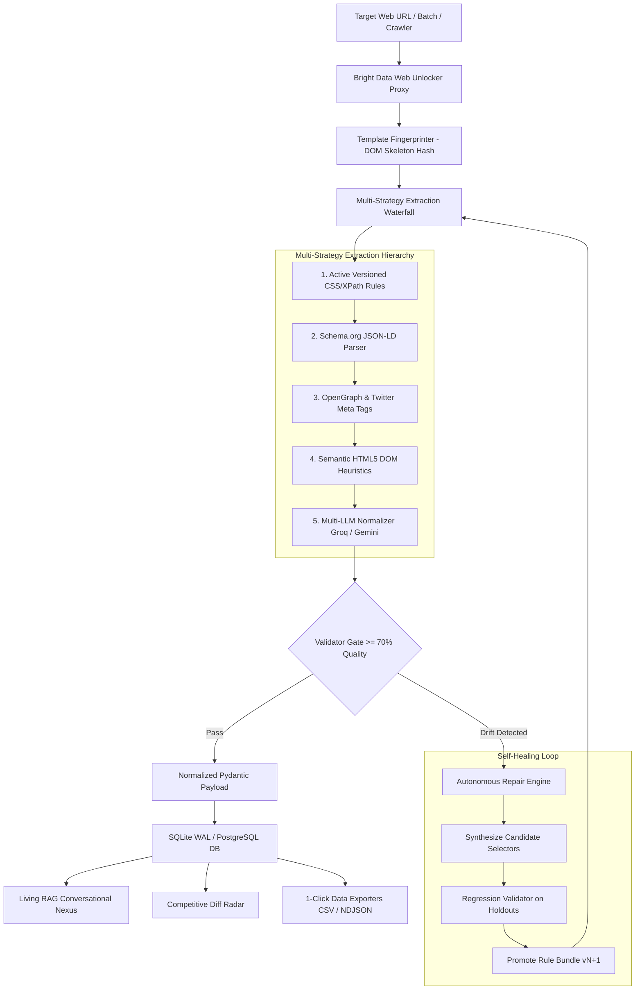

# MarketScout — Autonomous Self-Healing Web Scraper & Intelligence Platform

<p align="center">
  <a href="https://github.com/akshat-lakhera/scrapper">
    
  </a>
</p>

<p align="center">
  
  
  
  
  
  
  
</p>

---

**MarketScout** is an enterprise-grade autonomous web data intelligence platform that pairs **Bright Data Scraper Studio & Web Unlocker** with an **Autonomous Multi-Strategy Self-Healing Engine**, a **Recursive Deep Crawler**, a **Visual DOM Inspector & Selector Playground**, and a **Conversational Living RAG Nexus**.

It completely eliminates scraper maintenance and data rot by continuously monitoring DOM template drift, synthesizing replacement CSS selectors, running holdout regression validations, and promoting versioned rule bundles with **zero human intervention**.

---

## 📸 Platform Interface Gallery

### 1. Command Center & Extraction Sandbox
Interactive single-target, batch multi-URL, and deep crawl deployment with real-time 5-stage pipeline waterfall telemetry and dual-view entity inspection.


---

### 2. Autonomous Recursive Deep Crawler
Breadth-first link discovery and pagination traversal engine with configurable crawl depth ($1-3$) and page limits.


---

### 3. Interactive Visual DOM Inspector & Selector Playground
Real-time CSS selector testing engine that evaluates matching nodes, computes hierarchy lineage paths, calculates selector stability scores ($0-100\%$), and synthesizes AI candidate selectors.


---

### 4. Living RAG Knowledge Nexus & Conversational Intelligence
Multi-LLM grounded conversational assistant (Groq `llama-3.3-70b-versatile` + Google Gemini 2.5 Flash) with verified field-level source citations and direct canonical URLs.


---

### 5. Multi-Platform Extraction Studio
Pre-configured production presets across 8 major web protocols with high-resolution product image extraction and custom schema selectors.


---

### 6. Self-Healing Lab & Selector Synthesis Diff
Autonomous DOM drift diagnosis studio with visual side-by-side selector replacement diffs, stability scores, and versioned rule promotions ($v1 \rightarrow v2$).


---

## ⚡ Interactive Platform & Workflow Matrix

<table>
  <thead>
    <tr style="background-color: #0f131f;">
      <th align="center">🌐 Platform Preset</th>
      <th align="center">🛡️ Unblocking Strategy</th>
      <th align="center">⚡ Autonomous Healing</th>
      <th align="center">📦 Schema Contract</th>
      <th align="left">🔍 Extracted Attributes</th>
    </tr>
  </thead>
  <tbody>
    <tr>
      <td><b>🛒 Amazon E-Commerce</b></td>
      <td align="center"></td>
      <td align="center"></td>
      <td align="center"><code>PRODUCT_SCHEMA</code></td>
      <td>
        <details>
          <summary><b>View 8 Attributes</b></summary>
          <code>title</code>, <code>price</code>, <code>currency</code>, <code>availability</code>, <code>rating</code>, <code>review_count</code>, <code>seller</code>, <code>image_url</code>
        </details>
      </td>
    </tr>
    <tr>
      <td><b>📑 Tech Docs & APIs</b></td>
      <td align="center"></td>
      <td align="center"></td>
      <td align="center"><code>TECH_DOCS_SCHEMA</code></td>
      <td>
        <details>
          <summary><b>View 6 Attributes</b></summary>
          <code>doc_title</code>, <code>section_heading</code>, <code>content_body</code>, <code>code_snippet</code>, <code>last_updated</code>, <code>doc_url</code>
        </details>
      </td>
    </tr>
    <tr>
      <td><b>💼 Talent & Job Boards</b></td>
      <td align="center"></td>
      <td align="center"></td>
      <td align="center"><code>JOB_SCHEMA</code></td>
      <td>
        <details>
          <summary><b>View 7 Attributes</b></summary>
          <code>job_title</code>, <code>company</code>, <code>location</code>, <code>employment_type</code>, <code>salary</code>, <code>description</code>, <code>posted_date</code>
        </details>
      </td>
    </tr>
    <tr>
      <td><b>👔 LinkedIn Profiles</b></td>
      <td align="center"></td>
      <td align="center"></td>
      <td align="center"><code>LINKEDIN_PROFILE_SCHEMA</code></td>
      <td>
        <details>
          <summary><b>View 7 Attributes</b></summary>
          <code>name</code>, <code>headline</code>, <code>current_company</code>, <code>location</code>, <code>about</code>, <code>connections</code>, <code>education</code>
        </details>
      </td>
    </tr>
    <tr>
      <td><b>🐦 X (Twitter) Posts</b></td>
      <td align="center"></td>
      <td align="center"></td>
      <td align="center"><code>X_POST_SCHEMA</code></td>
      <td>
        <details>
          <summary><b>View 7 Attributes</b></summary>
          <code>user_posted</code>, <code>description</code>, <code>likes</code>, <code>reposts</code>, <code>replies</code>, <code>views</code>, <code>date_posted</code>
        </details>
      </td>
    </tr>
    <tr>
      <td><b>📸 Instagram Profiles</b></td>
      <td align="center"></td>
      <td align="center"></td>
      <td align="center"><code>INSTAGRAM_PROFILE_SCHEMA</code></td>
      <td>
        <details>
          <summary><b>View 6 Attributes</b></summary>
          <code>username</code>, <code>full_name</code>, <code>biography</code>, <code>followers_count</code>, <code>following_count</code>, <code>posts_count</code>
        </details>
      </td>
    </tr>
    <tr>
      <td><b>💬 Reddit Communities</b></td>
      <td align="center"></td>
      <td align="center"></td>
      <td align="center"><code>REDDIT_POST_SCHEMA</code></td>
      <td>
        <details>
          <summary><b>View 6 Attributes</b></summary>
          <code>title</code>, <code>subreddit</code>, <code>user_posted</code>, <code>description</code>, <code>upvotes</code>, <code>num_comments</code>
        </details>
      </td>
    </tr>
    <tr>
      <td><b>📍 Google Maps POI</b></td>
      <td align="center"></td>
      <td align="center"></td>
      <td align="center"><code>GOOGLE_MAPS_SCHEMA</code></td>
      <td>
        <details>
          <summary><b>View 8 Attributes</b></summary>
          <code>title</code>, <code>address</code>, <code>phone</code>, <code>rating</code>, <code>reviews_count</code>, <code>category</code>, <code>latitude</code>, <code>longitude</code>
        </details>
      </td>
    </tr>
  </tbody>
</table>

---

## 🌊 5-Stage Multi-Strategy Waterfall



---

## 🔬 Core Architectural Pillars

### 1. 🛡️ Autonomous Self-Healing Pipeline
* **DOM Skeleton Hash Fingerprinting (`TemplateFingerprinter`)**: Isolates unique structural layouts across millions of URLs.
* **Candidate Selector Synthesizer (`RepairEngine`)**: Traverses mutated DOM trees to compute optimal replacement selectors with stability metrics.
* **Holdout Regression Gate (`RegressionValidator`)**: Runs candidate patches against reference holdout snapshots before promotion ($\ge 70\%$ confidence).
* **Automated Rule Versioning**: Seamlessly promotes bundles ($v1 \rightarrow v2$) with zero downtime.

---

### 2. 🎯 Interactive Visual DOM Inspector (`DOMInspectorService`)
* **Real-Time Selector Playground**: Type any CSS selector to inspect matched elements, hierarchy traces, and outer HTML previews.
* **Stability Scoring Formula**: Evaluates selector resilience ($0-100\%$) penalizing volatile/hash classes and rewarding semantic attributes.
* **AI Candidate Synthesis**: Instant 1-click candidate generator for `Price`, `Title`, `Availability`, `Rating`, and `Doc Body`.

---

### 3. 🕸️ Autonomous Recursive Deep Crawler (`CrawlerService`)
* **Breadth-First Link Discovery**: Traverses internal hyperlinks, discovering entity URLs (`/dp/`, `/jobs/`, `/docs/`, `/catalogue/`).
* **Automated Pagination Following**: Detects `rel=next`, `a.next`, and `page=\d+` query parameters.
* **Safety & Asset Filters**: Automatically strips static assets (`.css`, `.jpg`, `.pdf`), external domains, and authentication loops.
* **Crawl Controls**: Configurable `max_depth` (1 to 3) and `max_pages` (up to 10 pages) with unified aggregated reporting.

---

### 4. 🧠 Living RAG Knowledge Nexus (`RAGService`)
* **Multi-LLM Backbone**: Powered by Groq `llama-3.3-70b-versatile` and Google Gemini 2.5 Flash.
* **Conversational Intent Router**: Differentiates general conversational inquiries from entity-specific lookups.
* **Target Relevance Scoring**: Whole-word semantic token matching to cite only the relevant target entity.
* **Zero-Rot Guarantee**: The RAG knowledge base never suffers from stale data because ingestion extractors heal themselves automatically.

---

### 5. 📊 Competitive Intelligence & Diff Radar (`IntelService`)
* **Historical Run Diffing**: Detects price fluctuations, stock status transitions, and newly added specifications.
* **Automated Executive Briefings**: Generates real-time AI summaries of competitor movements.

---

### 6. 📦 Batch Execution & Multi-Format Exporters
* **Concurrent Multi-Target Scraping**: Paste multi-line URL lists in the Omnibar to scrape concurrently.
* **1-Click Exporters**: Export all verified records to **CSV**, **NDJSON**, or **JSON** directly via REST API or UI.

---

## ⚡ Quick Start Guide

### 1. Prerequisites
* Python 3.11+
* Node.js 18+ and npm

### 2. Installation & Environment Setup
Clone the repository and copy the environment configuration:
```bash
git clone https://github.com/akshat-lakhera/scrapper.git
cd scrapper
cp .env.example .env
```

Configure your `.env` credentials:
```env
SCRAPER_PROVIDER=brightdata
BRIGHTDATA_API_KEY=your_brightdata_api_key_here
BRIGHTDATA_BASE_URL=https://api.brightdata.com
BRIGHTDATA_PRODUCT_DATASET_ID=gd_l7q7dkf244hwjntr0
GROQ_API_KEY=your_groq_api_key_here
GEMINI_API_KEY=your_gemini_api_key_here
DATABASE_URL=sqlite:///./data/marketscout.db
```

### 3. Build & Run (Unified Single-Port Mode)
```bash
# 1. Build the frontend production bundle
cd frontend
npm install
npm run build
cd ..

# 2. Start the unified FastAPI backend
cd backend
python -m uvicorn app.main:app --port 8000 --host 127.0.0.1
```
Open **[http://127.0.0.1:8000](http://127.0.0.1:8000)** in your browser.

---

## 💻 Multi-Language SDK Code Generator

MarketScout provides pre-built client SDK snippets across multiple programming languages:

### Python (`httpx` / `asyncio`)
```python
import httpx
import asyncio

async def scrape():
    async with httpx.AsyncClient() as client:
        res = await client.post("http://localhost:8000/api/scrape", json={
            "target_url": "https://fastapi.tiangolo.com/",
            "workflow_type": "tech_docs"
        })
        print(res.json()["extracted_data"])

asyncio.run(scrape())
```

### TypeScript / Node.js
```typescript
import axios from 'axios';

async function run() {
  const { data } = await axios.post('http://localhost:8000/api/scrape', {
    target_url: 'https://www.amazon.com/dp/B09XS7JWHH',
    workflow_type: 'products'
  });
  console.log('Price:', data.extracted_data.price);
}
run();
```

### cURL
```bash
curl -X POST "http://localhost:8000/api/scrape" \
     -H "Content-Type: application/json" \
     -d '{"target_url": "https://fastapi.tiangolo.com/", "workflow_type": "tech_docs"}'
```

---

## 🤖 Headless CLI Bridge (`python -m app.cli`)

Execute headless scrapers and CI validation directly from your terminal:
```bash
# Check cluster configuration and Bright Data Web Unlocker status
python -m app.cli status

# Scrape target with autonomous self-healing and JSON output
python -m app.cli run "https://fastapi.tiangolo.com/" --workflow tech_docs --auto-heal --json

# Headless CI runner (exits 0 on pass, 1 on regression failure)
python -m app.cli ci-run "https://demo.local/product_v1.html" --workflow products --strict

# Ask natural language questions against scraped Living RAG knowledge base
python -m app.cli ask "What is the price of the Sony headphones?"

# Generate automated competitor intelligence briefing
python -m app.cli intel --domain amazon.com
```

---

## 🧪 Testing & Quality Assurance

Run the comprehensive unit, integration, crawler, and DOM inspector test suite (**62/62 passing 100%**):
```bash
cd backend
pytest -v
```
```
======================= 62 passed, 2 warnings in 14.96s =======================
```

---

## 📄 License

This project is licensed under the **MIT License** - see the [LICENSE](LICENSE) file for details.
