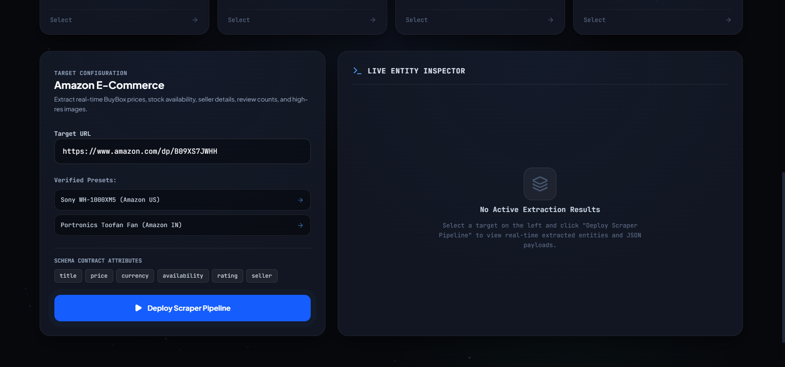
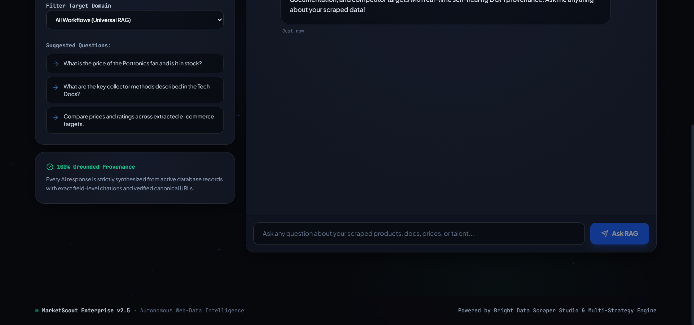
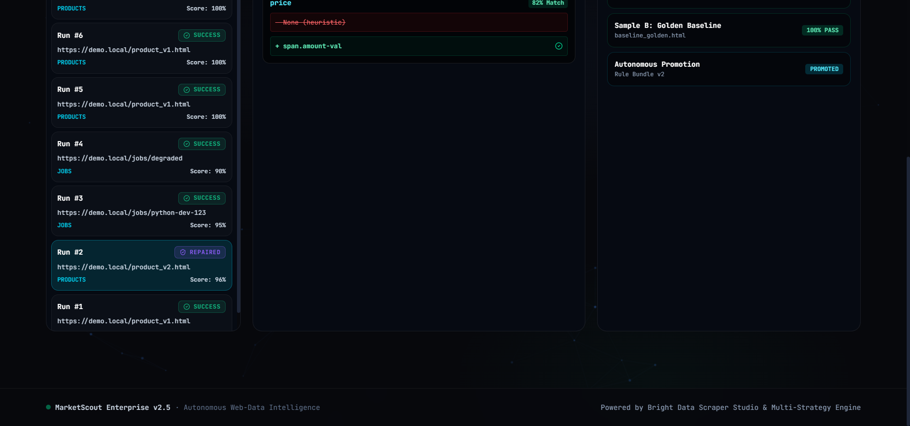
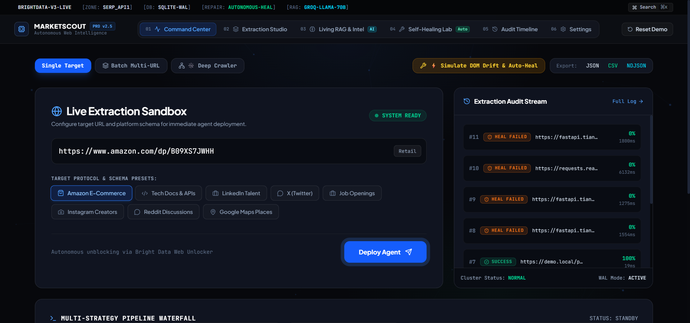
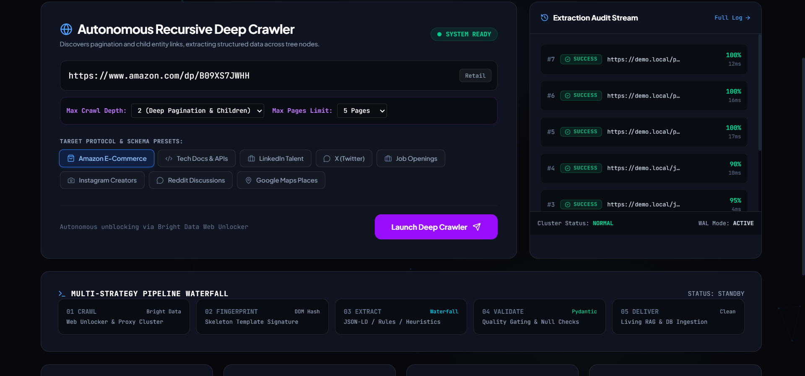
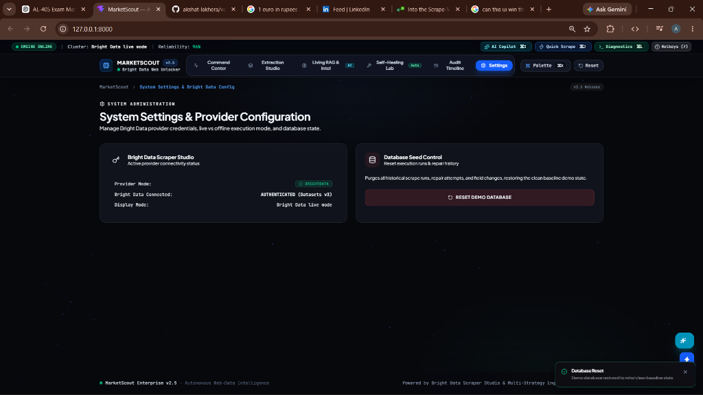
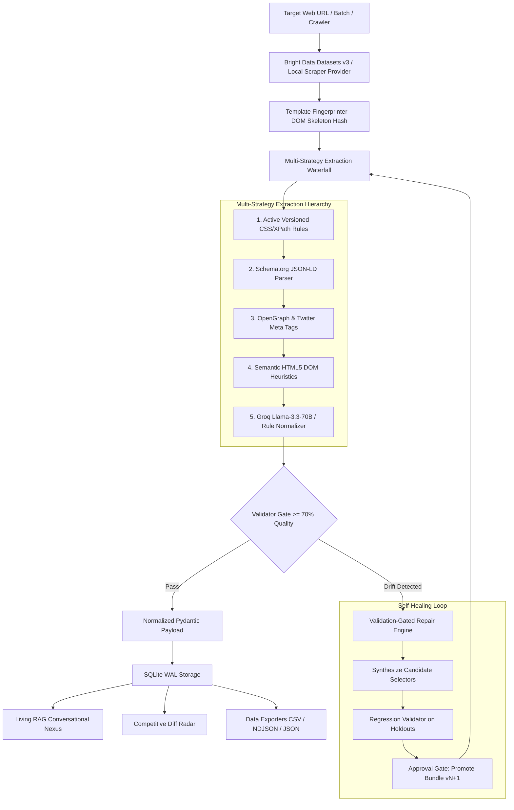

# MarketScout — Web Scraper & Intelligence Platform

<p align="center">
  <a href="https://github.com/akshat-lakhera/scrapper">
    
  </a>
</p>

<p align="center">
  
  
  
  
  
  
  
</p>

---

## 📖 Overview

**MarketScout** is a hackathon prototype web-data monitoring and scraping platform that demonstrates structured extraction, data-quality validation, degradation detection, and repair-oriented scraper workflows.

The currently verified live integration uses **Bright Data Datasets v3** for Amazon product extraction. The application also includes product/job/tech-docs schemas, offline validation tests, a validation-gated repair state machine, execution run history, a recursive deep crawler, an interactive DOM inspector, and a dark-mode dashboard.

> **Provider Notice**: The verified live path currently uses **Bright Data Datasets v3** for Amazon product extraction. Bright Data Scraper Studio custom-collector creation (`c_...`) and live healing are separate capabilities that require separate verification. Bright Data Web Unlocker is an independent proxy/unblocking API and is not claimed as active unless specifically configured and tested.

---

## 📊 Capability Status

| Capability | Status | Evidence / Notes |
|:---|:---|:---|
| **Amazon Product Live Extraction** | **Verified Live** | Tested against live Amazon URLs via Bright Data Datasets v3 API |
| **Structured Entity Normalization** | **Verified** | Standardized pricing, ratings, currency, and timestamps (`normalizer.py`) |
| **Pydantic Schema Validation** | **Verified** | Field type checks and data quality scoring ($\ge 70\%$) (`validator.py`) |
| **Offline Drift Degradation Detection** | **Verified** | Detects broken selectors against mutated HTML fixtures (`test_milestone2_repair_proof.py`) |
| **Offline Repair State Machine & AST Synthesis** | **Verified Offline** | Synthesizes replacement selectors and runs holdout regression tests (`repair_engine.py`) |
| **Scraper Studio Custom Collector Creation** | **Requires Live Verification** | Endpoint and CLI scaffolded; requires active Bright Data custom collector |
| **Live Custom Collector Healing** | **Requires Live Verification** | Workflow scaffolded; requires active Scraper Studio session |
| **Job Board Extraction** | **Verified Offline** | Local fixtures tested; live path requires `BRIGHTDATA_JOB_DATASET_ID` |
| **SERP Keyword Search** | **Configured** | Scaffolded; requires active SERP API zone credentials |
| **Web Unlocker Integration** | **Configured / Fallback** | Proxy tunnel path implemented; requires Web Unlocker zone verification |
| **Recursive Deep Crawler** | **Verified Offline / Experimental** | Traverses internal links with configurable depth (1–3) (`crawler_service.py`) |
| **Visual DOM Inspector & Selector Tester** | **Verified Offline** | Evaluates CSS selectors and computes stability metrics in real time (`dom_inspector_service.py`) |
| **Living RAG Knowledge Assistant** | **Verified Local / Groq** | Grounded retrieval over SQLite index via Groq `llama-3.3-70b-versatile` |
| **Google Gemini Integration** | **Not Configured** | Active implementation uses Groq Llama-3.3-70B for LLM synthesis |
| **PostgreSQL Deployment** | **Not Verified** | Uses SQLite with WAL mode by default |

---

## 📸 Platform Interface Gallery

### 1. Command Center & Extraction Sandbox
Interactive single-target, batch multi-URL, and deep crawl deployment with 5-stage pipeline waterfall telemetry and dual-view entity inspection.


---

### 2. Multi-Platform Extraction Studio & Schema Engine
Pre-configured schema contracts across 8 major web protocols with live entity inspection and blueprint contracts.



---

### 3. Living RAG Knowledge Nexus & Grounded Intelligence
Grounded conversational assistant powered by Groq `llama-3.3-70b-versatile` with structured HTML comparison tables and field-level database citations.



---

### 4. Self-Healing Lab & Selector Synthesis Diff
DOM drift diagnosis studio with visual side-by-side selector replacement diffs, AST regression checks, and versioned rule bundle promotions with validation gating ($v1 \rightarrow v2$).



---

### 5. Interactive Visual DOM Inspector & Selector Playground
Real-time CSS selector testing engine that evaluates matching nodes, computes hierarchy lineage paths, calculates selector stability scores ($0-100\%$), and synthesizes candidate selectors.



---

### 6. Recursive Deep Crawler
Breadth-first link discovery and pagination traversal engine with configurable crawl depth ($1-3$) and page limits.



---

### 7. System Administration & Provider Hub
Control center for inspecting Bright Data Datasets v3 status, adjusting crawler concurrency worker sliders, configuring healing policies, and viewing webhook pipeline dispatchers.



---

## ⚡ Workflow & Protocol Status Matrix

<table>
  <thead>
    <tr style="background-color: #0f131f;">
      <th align="center">🌐 Platform Preset</th>
      <th align="center">🛡️ Integration Path</th>
      <th align="center">⚡ Healing Strategy</th>
      <th align="center">📦 Schema Contract</th>
      <th align="left">🔍 Extracted Attributes</th>
    </tr>
  </thead>
  <tbody>
    <tr>
      <td><b>🛒 Amazon E-Commerce</b></td>
      <td align="center"></td>
      <td align="center"></td>
      <td align="center"><code>PRODUCT_SCHEMA</code></td>
      <td>
        <details>
          <summary><b>View 8 Attributes</b></summary>
          <code>title</code>, <code>price</code>, <code>currency</code>, <code>availability</code>, <code>rating</code>, <code>review_count</code>, <code>seller</code>, <code>image_url</code>
        </details>
      </td>
    </tr>
    <tr>
      <td><b>📑 Tech Docs & APIs</b></td>
      <td align="center"></td>
      <td align="center"></td>
      <td align="center"><code>TECH_DOCS_SCHEMA</code></td>
      <td>
        <details>
          <summary><b>View 6 Attributes</b></summary>
          <code>doc_title</code>, <code>section_heading</code>, <code>content_body</code>, <code>code_snippet</code>, <code>last_updated</code>, <code>doc_url</code>
        </details>
      </td>
    </tr>
    <tr>
      <td><b>💼 Talent & Job Boards</b></td>
      <td align="center"></td>
      <td align="center"></td>
      <td align="center"><code>JOB_SCHEMA</code></td>
      <td>
        <details>
          <summary><b>View 7 Attributes</b></summary>
          <code>job_title</code>, <code>company</code>, <code>location</code>, <code>employment_type</code>, <code>salary</code>, <code>description</code>, <code>posted_date</code>
        </details>
      </td>
    </tr>
    <tr>
      <td><b>👔 LinkedIn Profiles</b></td>
      <td align="center"></td>
      <td align="center"></td>
      <td align="center"><code>LINKEDIN_PROFILE_SCHEMA</code></td>
      <td>
        <details>
          <summary><b>View 7 Attributes</b></summary>
          <code>name</code>, <code>headline</code>, <code>current_company</code>, <code>location</code>, <code>about</code>, <code>connections</code>, <code>education</code>
        </details>
      </td>
    </tr>
    <tr>
      <td><b>🐦 X (Twitter) Posts</b></td>
      <td align="center"></td>
      <td align="center"></td>
      <td align="center"><code>X_POST_SCHEMA</code></td>
      <td>
        <details>
          <summary><b>View 7 Attributes</b></summary>
          <code>user_posted</code>, <code>description</code>, <code>likes</code>, <code>reposts</code>, <code>replies</code>, <code>views</code>, <code>date_posted</code>
        </details>
      </td>
    </tr>
    <tr>
      <td><b>📸 Instagram Profiles</b></td>
      <td align="center"></td>
      <td align="center"></td>
      <td align="center"><code>INSTAGRAM_PROFILE_SCHEMA</code></td>
      <td>
        <details>
          <summary><b>View 6 Attributes</b></summary>
          <code>username</code>, <code>full_name</code>, <code>biography</code>, <code>followers_count</code>, <code>following_count</code>, <code>posts_count</code>
        </details>
      </td>
    </tr>
    <tr>
      <td><b>💬 Reddit Communities</b></td>
      <td align="center"></td>
      <td align="center"></td>
      <td align="center"><code>REDDIT_POST_SCHEMA</code></td>
      <td>
        <details>
          <summary><b>View 6 Attributes</b></summary>
          <code>title</code>, <code>subreddit</code>, <code>user_posted</code>, <code>description</code>, <code>upvotes</code>, <code>num_comments</code>
        </details>
      </td>
    </tr>
    <tr>
      <td><b>📍 Google Maps POI</b></td>
      <td align="center"></td>
      <td align="center"></td>
      <td align="center"><code>GOOGLE_MAPS_SCHEMA</code></td>
      <td>
        <details>
          <summary><b>View 8 Attributes</b></summary>
          <code>title</code>, <code>address</code>, <code>phone</code>, <code>rating</code>, <code>reviews_count</code>, <code>category</code>, <code>latitude</code>, <code>longitude</code>
        </details>
      </td>
    </tr>
  </tbody>
</table>

---

## 🌊 5-Stage Multi-Strategy Waterfall



---

## 🔬 Core Architectural Components

### 1. 🛡️ Validation-Gated Self-Healing Workflow
* **DOM Skeleton Fingerprinting (`TemplateFingerprinter`)**: Generates structural hashes from DOM element hierarchies to isolate distinct website templates.
* **Candidate Selector Synthesizer (`RepairEngine`)**: Traverses mutated DOM trees to propose replacement CSS selectors with stability scoring.
* **Holdout Regression Gate (`RegressionValidator`)**: Tests candidate patches against historical snapshot holdouts before promotion.
* **Explicit Promotion Gate**: Provides an approval workflow before incrementing rule versions ($v1 \rightarrow v2$).

---

### 2. 🎯 Interactive Visual DOM Inspector (`DOMInspectorService`)
* **Real-Time Selector Tester**: Evaluates CSS selectors against local or scraped HTML, calculating node counts and hierarchy paths.
* **Stability Scoring Formula**: Penalizes volatile/hashed class names and rewards semantic tag hierarchies ($0-100\%$).
* **Candidate Selector Suggestions**: Proposes potential selectors for key fields like `price` and `title`.

---

### 3. 🕸️ Recursive Deep Crawler (`CrawlerService`)
* **Breadth-First Link Discovery**: Traverses internal HTML hyperlinks within the same domain.
* **Automated Pagination Detection**: Recognizes pagination indicators (`rel=next`, `page=\d+`).
* **Safety Filters**: Filters out non-HTML static assets (`.css`, `.png`, `.pdf`) and external URLs.
* **Depth & Page Controls**: Supports configurable `max_depth` (1–3) and `max_pages` limits.

---

### 4. 🧠 Living RAG Knowledge Assistant (`RAGService`)
* **LLM Engine**: Powered by Groq `llama-3.3-70b-versatile`.
* **Grounded Retrieval**: Queries the local SQLite database of extracted entities to synthesize answers without external hallucinations.
* **Source Citations**: Returns field-level provenance linking each extracted metric back to its original scrape run.

---

### 5. 📊 Competitive Intelligence & Diff Radar (`IntelService`)
* **Historical Run Diffing**: Compares extracted records across runs to detect price fluctuations and stock changes.
* **Structured Summaries**: Synthesizes field changes into scannable markdown comparison tables.

---

### 6. 📦 Data Exporters
* **Multi-Format Export**: Export verified scrape runs directly to **JSON**, **CSV**, or **NDJSON** via REST API endpoints (`/api/export/runs?format=json`).

---

## ⚡ Quick Start Guide

### 1. Prerequisites
* Python 3.11+
* Node.js 18+ and npm

### 2. Installation & Environment Setup
Clone the repository and copy the environment configuration:
```bash
git clone https://github.com/akshat-lakhera/scrapper.git
cd scrapper
cp .env.example .env
```

Configure your `.env` credentials with your own keys:
```env
SCRAPER_PROVIDER=brightdata
BRIGHTDATA_API_KEY=your_brightdata_api_key_here
BRIGHTDATA_BASE_URL=https://api.brightdata.com
BRIGHTDATA_PRODUCT_DATASET_ID=your_product_dataset_id
GROQ_API_KEY=your_groq_api_key_here
DATABASE_URL=sqlite:///./data/marketscout.db
```

### 3. Build & Run (Unified Single-Port Mode)
```bash
# 1. Build the frontend production bundle
cd frontend
npm install
npm run build
cd ..

# 2. Start the unified FastAPI backend
cd backend
python -m uvicorn app.main:app --port 8000 --host 127.0.0.1
```
Open **[http://127.0.0.1:8000](http://127.0.0.1:8000)** in your browser.

---

## 💻 API & SDK Code Examples

### Python (`httpx`)
```python
import httpx
import asyncio

async def scrape():
    async with httpx.AsyncClient() as client:
        res = await client.post("http://localhost:8000/api/scrape", json={
            "target_url": "https://fastapi.tiangolo.com/",
            "workflow_type": "tech_docs"
        })
        print(res.json().get("extracted_data"))

asyncio.run(scrape())
```

### cURL
```bash
curl -X POST "http://localhost:8000/api/scrape" \
     -H "Content-Type: application/json" \
     -d '{"target_url": "https://fastapi.tiangolo.com/", "workflow_type": "tech_docs"}'
```

---

## 🤖 Headless CLI Runner (`python -m app.cli`)

Execute scrapers and inspection tools from your terminal:
```bash
# Check provider and cluster status
python -m app.cli status

# Scrape target with validation-gated healing flag
python -m app.cli run "https://fastapi.tiangolo.com/" --workflow tech_docs --auto-heal --json

# Run CI verification (exits 0 on pass, 1 on failure)
python -m app.cli ci-run "https://demo.local/product_v1.html" --workflow products --strict

# Query the grounded Living RAG assistant
python -m app.cli ask "What is the price of the Sony headphones?"

# Generate competitor intelligence diff summary
python -m app.cli intel --domain amazon.com
```

---

## 🧪 Testing & Quality Assurance

Run the comprehensive pytest suite:
```bash
cd backend
pytest -q
```
```
...................................................................      [100%]
67 passed, 1 warning in 15.68s
```

---

## 📄 License

This project is licensed under the **MIT License** - see the [LICENSE](LICENSE) file for details.
