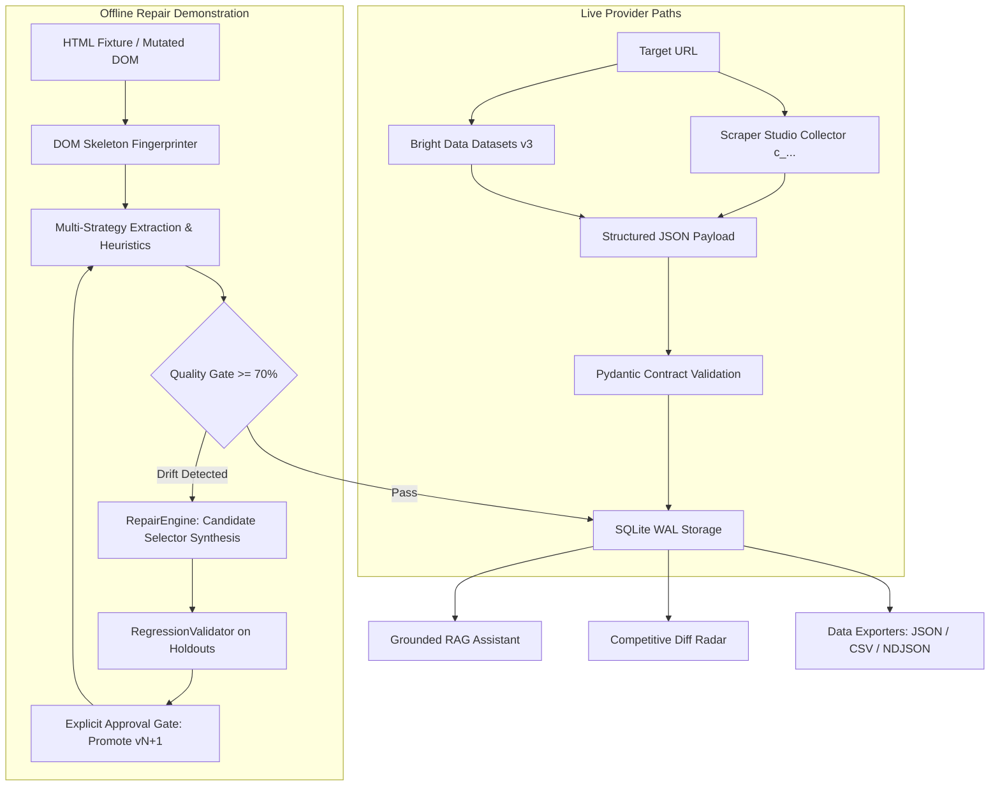

# MarketScout — Web Scraper & Monitoring Platform

<p align="center">
  <a href="https://github.com/akshat-lakhera/scrapper">
    
  </a>
</p>

<p align="center">
  
  
  
  
  
  
  
</p>

---

## 📖 Overview

**MarketScout** is a hackathon prototype web-data monitoring and scraping platform that demonstrates structured extraction, data-quality validation, degradation detection, and repair-oriented scraper workflows.

> **Live-Integration Limitation**: The repository currently verifies the managed Amazon Datasets v3 path live. Scraper Studio custom-collector creation, healing, approval, and rerun are integration wrappers unless a live `c_...` collector test is supplied. Offline selector repair is deterministic and independent of the managed provider.

The project models the **Bright Data Scraper Studio** custom collector lifecycle (`create` $\rightarrow$ `run` $\rightarrow$ `heal` $\rightarrow$ `approve` $\rightarrow$ `rerun`). **Bright Data Datasets v3** is also integrated as a secondary managed-data pipeline for Amazon product extraction. The application includes a dark-mode dashboard, execution run history, a recursive deep crawler, an interactive DOM inspector, and a grounded RAG knowledge assistant.

---

## 🎬 Hackathon Demo Workflow

MarketScout models the Bright Data Scraper Studio lifecycle with explicit validation gating:

1. **Create Custom Collector**: Initialize a custom collector (`c_...`) from a target URL and schema instruction.
2. **Execute Initial Scrape**: Run the collector to ingest structured JSON output.
3. **Detect Degradation / Drift**: Flag missing fields or schema contract failures when upstream layouts change.
4. **Request an AI Repair Proposal**: Submit a repair request (`bdata scraper heal` / Scraper Studio AI Flow).
5. **Review & Approval Gate**: Review proposed repair details and approval status before applying updates (`bdata scraper approve`).
6. **Rerun & Validate**: Re-execute the same collector ID to confirm field recovery and display the before/after diff.

```
[bdata scraper create] ──> [bdata scraper run] ──> [Detect Drift / Degradation]
                                                            │
[bdata scraper run again] <── [bdata scraper approve] <── [bdata scraper heal]
```

> **Collector Persistence**: The custom collector maintains its unique ID (`c_...`) throughout the repair process. The dashboard records the collector ID, run status, repair attempt, approval decision, validation score, and normalized output.

---

## 📊 Capability Status Matrix

| Capability | Status | Implementation / Verification Notes |
|:---|:---|:---|
| **Scraper Studio Custom Collector Creation** | **Scaffolded / API Integration Present** | CLI and backend API wrappers implemented for custom `c_...` collector lifecycle |
| **Live Custom Collector Healing** | **Scaffolded / API Integration Present** | Backend commands/API wrappers for requesting and recording Scraper Studio repair proposals |
| **Amazon Datasets v3 Live Extraction** | **Verified Live** | Secondary managed-data extraction tested against live Amazon product URLs |
| **Structured Entity Normalization** | **Verified** | Standardized pricing, ratings, currency, and timestamps (`normalizer.py`) |
| **Pydantic Schema Validation** | **Verified** | Field type checks and data quality scoring ($\ge 70\%$) (`validator.py`) |
| **Local / Offline Repair State Machine** | **Verified Offline** | Proposes replacement CSS selectors and runs holdout regression tests (`repair_engine.py`) |
| **Job Board Extraction** | **Verified Offline** | Local fixtures tested; live path requires `BRIGHTDATA_JOB_DATASET_ID` |
| **SERP Keyword Search** | **Configured** | Scaffolded; requires active SERP API zone credentials |
| **Web Unlocker Proxy Tunnel** | **Configured** | Proxy client implemented; requires active Web Unlocker credentials |
| **Recursive Deep Crawler** | **Verified Offline / Experimental** | Traverses internal links with configurable depth (1–3) (`crawler_service.py`) |
| **Interactive Visual DOM Inspector** | **Verified Offline** | Evaluates CSS selectors and computes stability metrics on local/scraped HTML |
| **Grounded RAG Knowledge Assistant** | **Verified Local / Groq** | Grounded retrieval over SQLite index via Groq `llama-3.3-70b-versatile` |
| **PostgreSQL Deployment** | **Not Verified** | Uses SQLite with WAL mode by default |

---

## 📸 Platform Interface Gallery

### 1. Command Center & Extraction Sandbox
Interactive single-target, batch multi-URL, and deep crawl deployment with 5-stage pipeline waterfall telemetry and dual-view entity inspection.


---

### 2. Multi-Platform Extraction Studio & Schema Engine
Pre-configured schema contracts for eight target categories. Live-provider status varies by category and is listed in the capability matrix.


---

### 3. Grounded RAG Knowledge Assistant
Grounded conversational assistant powered by Groq `llama-3.3-70b-versatile` with structured HTML comparison tables and field-level database citations.


---

### 4. Self-Healing Lab & Selector Synthesis Diff
DOM drift diagnosis studio with visual side-by-side selector replacement diffs, AST regression checks, and versioned rule bundle promotions with validation gating ($v1 \rightarrow v2$).


---

### 5. Interactive Visual DOM Inspector & Selector Playground
Interactive CSS selector testing engine that evaluates matching nodes, computes hierarchy lineage paths, calculates selector stability scores ($0-100\%$), and synthesizes candidate selectors.


---

### 6. Recursive Deep Crawler
Breadth-first link discovery and pagination traversal engine with configurable crawl depth ($1-3$) and page limits.


---

### 7. System Administration & Provider Hub
Control center for inspecting Bright Data provider status, adjusting crawler concurrency worker sliders, configuring healing policies, and viewing webhook pipeline dispatchers.


---

## ⚡ Workflow & Target Protocol Matrix

> **Status Legend**:
> - `VERIFIED LIVE`: Tested against live upstream providers.
> - `VERIFIED OFFLINE`: Deterministically tested against local HTML fixtures.
> - `CONFIGURED`: Pydantic schema contract and provider mappings exist; live behavior requires active API tokens.

<table>
  <thead>
    <tr style="background-color: #0f131f;">
      <th align="center">🌐 Target Category</th>
      <th align="center">🛡️ Integration Path</th>
      <th align="center">⚡ Healing Strategy</th>
      <th align="center">📦 Schema Contract</th>
      <th align="left">🔍 Extracted Attributes</th>
    </tr>
  </thead>
  <tbody>
    <tr>
      <td><b>🛒 Amazon E-Commerce</b></td>
      <td align="center"></td>
      <td align="center"></td>
      <td align="center"><code>PRODUCT_SCHEMA</code></td>
      <td>
        <details>
          <summary><b>View 8 Attributes</b></summary>
          <code>title</code>, <code>price</code>, <code>currency</code>, <code>availability</code>, <code>rating</code>, <code>review_count</code>, <code>seller</code>, <code>image_url</code>
        </details>
      </td>
    </tr>
    <tr>
      <td><b>📑 Tech Docs & APIs</b></td>
      <td align="center"></td>
      <td align="center"></td>
      <td align="center"><code>TECH_DOCS_SCHEMA</code></td>
      <td>
        <details>
          <summary><b>View 6 Attributes</b></summary>
          <code>doc_title</code>, <code>section_heading</code>, <code>content_body</code>, <code>code_snippet</code>, <code>last_updated</code>, <code>doc_url</code>
        </details>
      </td>
    </tr>
    <tr>
      <td><b>💼 Talent & Job Boards</b></td>
      <td align="center"></td>
      <td align="center"></td>
      <td align="center"><code>JOB_SCHEMA</code></td>
      <td>
        <details>
          <summary><b>View 7 Attributes</b></summary>
          <code>job_title</code>, <code>company</code>, <code>location</code>, <code>employment_type</code>, <code>salary</code>, <code>description</code>, <code>posted_date</code>
        </details>
      </td>
    </tr>
    <tr>
      <td><b>👔 LinkedIn Profiles</b></td>
      <td align="center"></td>
      <td align="center"></td>
      <td align="center"><code>LINKEDIN_PROFILE_SCHEMA</code></td>
      <td>
        <details>
          <summary><b>View 7 Attributes</b></summary>
          <code>name</code>, <code>headline</code>, <code>current_company</code>, <code>location</code>, <code>about</code>, <code>connections</code>, <code>education</code>
        </details>
      </td>
    </tr>
    <tr>
      <td><b>🐦 X (Twitter) Posts</b></td>
      <td align="center"></td>
      <td align="center"></td>
      <td align="center"><code>X_POST_SCHEMA</code></td>
      <td>
        <details>
          <summary><b>View 7 Attributes</b></summary>
          <code>user_posted</code>, <code>description</code>, <code>likes</code>, <code>reposts</code>, <code>replies</code>, <code>views</code>, <code>date_posted</code>
        </details>
      </td>
    </tr>
    <tr>
      <td><b>📸 Instagram Profiles</b></td>
      <td align="center"></td>
      <td align="center"></td>
      <td align="center"><code>INSTAGRAM_PROFILE_SCHEMA</code></td>
      <td>
        <details>
          <summary><b>View 6 Attributes</b></summary>
          <code>username</code>, <code>full_name</code>, <code>biography</code>, <code>followers_count</code>, <code>following_count</code>, <code>posts_count</code>
        </details>
      </td>
    </tr>
    <tr>
      <td><b>💬 Reddit Communities</b></td>
      <td align="center"></td>
      <td align="center"></td>
      <td align="center"><code>REDDIT_POST_SCHEMA</code></td>
      <td>
        <details>
          <summary><b>View 6 Attributes</b></summary>
          <code>title</code>, <code>subreddit</code>, <code>user_posted</code>, <code>description</code>, <code>upvotes</code>, <code>num_comments</code>
        </details>
      </td>
    </tr>
    <tr>
      <td><b>📍 Google Maps POI</b></td>
      <td align="center"></td>
      <td align="center"></td>
      <td align="center"><code>GOOGLE_MAPS_SCHEMA</code></td>
      <td>
        <details>
          <summary><b>View 8 Attributes</b></summary>
          <code>title</code>, <code>address</code>, <code>phone</code>, <code>rating</code>, <code>reviews_count</code>, <code>category</code>, <code>latitude</code>, <code>longitude</code>
        </details>
      </td>
    </tr>
  </tbody>
</table>

---

## 🌊 Pipeline Architecture: Live vs. Offline Repair Paths



---

## 🕷️ Bright Data Scraper Studio Workflow

MarketScout includes integration wrappers for the Bright Data Scraper Studio CLI / API lifecycle for managing custom collectors (`c_...`):

### 1. Bright Data CLI Setup
The Scraper Studio workflow can be executed directly using the official Bright Data CLI. Verify your installation:
```bash
bdata --help
bdata scraper --help
```

### 2. Collector Creation & Initial Run
```bash
bdata login

# Create a custom collector with a natural-language prompt
bdata scraper create "https://your-public-target.example" \
  "Extract the item title, URL, category, price, and availability as structured JSON."

# Execute the custom collector against a target URL
bdata scraper run c_your_collector_id "https://your-public-target.example"
```

### 3. Validation-Gated Healing & Approval
When upstream layout changes cause missing fields or validation failures:
```bash
# Request an AI repair proposal for broken fields
bdata scraper heal c_your_collector_id \
  "The price and availability fields are missing due to class name changes. Repair extraction while preserving the existing schema."

# Review the proposed fix and approve the update
bdata scraper approve c_your_collector_id

# Rerun the repaired collector to verify recovered fields
bdata scraper run c_your_collector_id "https://your-public-target.example"
```

> **Security Note**: Never commit API keys, customer IDs, collector tokens, `.env` files, or proprietary scrape results to version control.

---

## 🔬 Core Architectural Components

### 1. 🛡️ Validation-Gated Self-Healing Workflow
* **DOM Skeleton Fingerprinting (`TemplateFingerprinter`)**: Generates structural hashes from DOM element hierarchies to isolate distinct website templates.
* **Candidate Selector Synthesizer (`RepairEngine`)**: Traverses mutated DOM trees to propose replacement CSS selectors with stability scoring.
* **Holdout Regression Gate (`RegressionValidator`)**: Tests candidate patches against historical snapshot holdouts before promotion.
* **Explicit Promotion Gate**: Provides an approval workflow before incrementing rule versions ($v1 \rightarrow v2$).

---

### 2. 🎯 Interactive Visual DOM Inspector (`DOMInspectorService`)
* **Interactive Selector Tester**: Evaluates CSS selectors against local or scraped HTML, calculating node counts and hierarchy paths.
* **Stability Scoring Formula**: Penalizes volatile/hashed class names and rewards semantic tag hierarchies ($0-100\%$).
* **Candidate Selector Suggestions**: Proposes potential selectors for key fields like `price` and `title`.

---

### 3. 🕸️ Recursive Deep Crawler (`CrawlerService`)
* **Breadth-First Link Discovery**: Traverses internal HTML hyperlinks within the same domain.
* **Automated Pagination Detection**: Recognizes pagination indicators (`rel=next`, `page=\d+`).
* **Safety Filters**: Filters out non-HTML static assets (`.css`, `.png`, `.pdf`) and external URLs.
* **Depth & Page Controls**: Supports configurable `max_depth` (1–3) and `max_pages` limits.

---

### 4. 🧠 Grounded RAG Knowledge Assistant (`RAGService`)
* **LLM Engine**: Powered by Groq `llama-3.3-70b-versatile`.
* **Grounded Retrieval**: The assistant answers from locally stored extraction runs; freshness depends on the configured scrape schedule and successful ingestion.
* **Source Citations**: Returns field-level provenance linking each extracted metric back to its original scrape run.

---

### 5. 📊 Competitive Intelligence & Diff Radar (`IntelService`)
* **Historical Run Diffing**: Compares extracted records across runs to detect price fluctuations and stock changes.
* **Structured Summaries**: Synthesizes field changes into scannable markdown comparison tables.

---

### 6. 📦 Data Exporters
* **Multi-Format Export**: Export verified scrape runs directly to **JSON**, **CSV**, or **NDJSON** via REST API endpoints (`/api/export/runs?format=json`).

---

## ✅ Demo Evidence

The repository demonstrates or documents:

### Verified Live
- Amazon product extraction through Bright Data Datasets v3.
- Structured normalization and Pydantic schema validation.
- SQLite run history and exported JSON/CSV/NDJSON data.
- Groq-grounded retrieval over stored extraction runs with source citations.

### Verified Offline
- DOM drift detection against mutated HTML fixtures.
- Candidate selector synthesis with structural tree heuristics.
- Holdout regression validation against historical snapshots.
- Explicit repair approval and rule-bundle versioning ($v1 \rightarrow v2$).
- Recursive crawler behavior and loop protection.
- DOM selector inspection and stability scoring.

### Integration Scaffolded, Not Live-Verified
- Bright Data Scraper Studio custom collector creation.
- Custom collector execution through the backend wrapper.
- Scraper Studio healing and approval lifecycle.

> The Scraper Studio commands are documented as the intended hackathon integration path. A live `c_...` collector demo will be claimed as verified only after the same collector completes create, run, heal, approve, rerun, and post-rerun validation.

---

## ⚡ Quick Start Guide

### 1. Prerequisites
* Python 3.11+
* Node.js 18+ and npm

### 2. Installation & Environment Setup
Clone the repository and copy the environment configuration:
```bash
git clone https://github.com/akshat-lakhera/scrapper.git
cd scrapper
cp .env.example .env
```

Configure your `.env` credentials:
```env
SCRAPER_PROVIDER=brightdata
BRIGHTDATA_API_KEY=your_brightdata_api_key_here
BRIGHTDATA_BASE_URL=https://api.brightdata.com
BRIGHTDATA_SCRAPER_STUDIO_COLLECTOR_ID=c_your_collector_id_here
BRIGHTDATA_PRODUCT_DATASET_ID=your_product_dataset_id
GROQ_API_KEY=your_groq_api_key_here
DATABASE_URL=sqlite:///./data/marketscout.db
```

> **Note**: `BRIGHTDATA_SCRAPER_STUDIO_COLLECTOR_ID` is optional for the offline demo and required only for the live Scraper Studio integration.

### 3. Build & Run (Unified Single-Port Mode)
```bash
# 1. Build the frontend production bundle
cd frontend
npm install
npm run build
cd ..

# 2. Start the unified FastAPI backend
cd backend
python -m uvicorn app.main:app --port 8000 --host 127.0.0.1
```
Open **[http://127.0.0.1:8000](http://127.0.0.1:8000)** in your browser.

---

## 💻 API & SDK Code Examples

### Python (`httpx`)
```python
import httpx
import asyncio

async def scrape():
    async with httpx.AsyncClient() as client:
        res = await client.post("http://localhost:8000/api/scrape", json={
            "target_url": "https://fastapi.tiangolo.com/",
            "workflow_type": "tech_docs"
        })
        print(res.json().get("extracted_data"))

asyncio.run(scrape())
```

### cURL
```bash
curl -X POST "http://localhost:8000/api/scrape" \
     -H "Content-Type: application/json" \
     -d '{"target_url": "https://fastapi.tiangolo.com/", "workflow_type": "tech_docs"}'
```

---

## 🤖 Headless CLI Runner (`python -m app.cli`)

Execute scrapers and inspection tools from your terminal:

### 1. MarketScout Local Validation Workflow
```bash
# Check provider and cluster configuration status
python -m app.cli status

# Inspect registered Scraper Studio collectors
python -m app.cli collectors

# Scrape target with validation-gated healing flag
python -m app.cli run "https://fastapi.tiangolo.com/" --workflow tech_docs --auto-heal --json

# Trigger validation-gated healing proposal for a degraded run
python -m app.cli heal 1 --json

# Approve repair proposal and promote rule bundle
python -m app.cli approve 1 1 --json

# Run CI verification on local fixture (exits 0 on pass, 1 on failure)
python -m app.cli ci-run "https://demo.local/product_v1.html" --workflow products --strict

# Query the grounded RAG knowledge assistant
python -m app.cli ask "What is the price of the Sony headphones?"

# Generate competitor intelligence diff summary
python -m app.cli intel --domain amazon.com
```

### 2. Bright Data Scraper Studio Workflow
```bash
# Request an AI repair proposal for broken fields on a live custom collector
bdata scraper heal c_your_collector_id "The price field is missing due to class rename."

# Approve the proposed fix
bdata scraper approve c_your_collector_id

# Rerun the repaired collector
bdata scraper run c_your_collector_id "https://your-target.example"
```

---

## 🧪 Testing & Quality Assurance

Run the test suite:
```bash
cd backend
pytest -q
```
```
...................................................................      [100%]
67 passed, 1 warning in 12.33s
```

---

## 📄 License

This project is licensed under the **MIT License** - see the [LICENSE](LICENSE) file for details.
