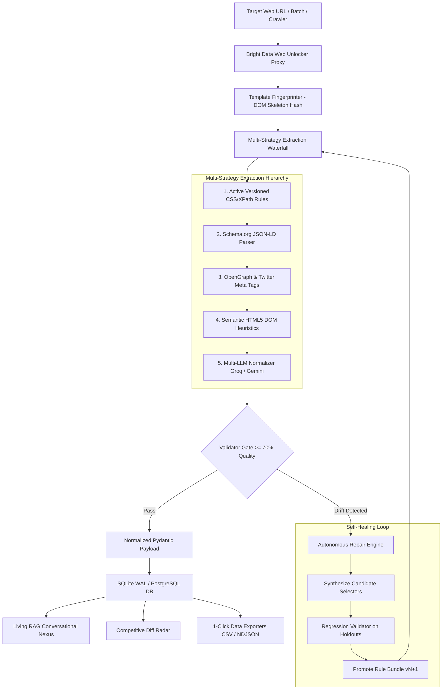

# MarketScout — Autonomous Self-Healing Web Scraper & Intelligence Platform

[]()
[-emerald.svg)]()
[](LICENSE)
[]()
[]()
[]()

**MarketScout** is an enterprise-grade autonomous web data intelligence platform powered by **Bright Data Scraper Studio & Web Unlocker**, an **Autonomous Multi-Strategy Self-Healing Engine**, a **Recursive Deep Crawler**, and a **Conversational Living RAG Nexus**.

It delivers continuous 0% data rot by automatically diagnosing DOM structural mutations, synthesizing candidate replacement CSS selectors, running holdout regression tests, and promoting versioned rule bundles with **zero human intervention**.

---

## 📸 Platform Interface Gallery

### 1. Command Center & Extraction Sandbox
Interactive single-target, batch multi-URL, and deep crawl deployment with real-time 5-stage pipeline waterfall telemetry and dual-view entity inspection.


---

### 2. Autonomous Recursive Deep Crawler
Breadth-first link discovery and pagination traversal engine with configurable crawl depth ($1-3$) and page limits.


---

### 3. Living RAG Knowledge Nexus & Conversational Intelligence
Multi-LLM grounded conversational assistant (Groq `llama-3.3-70b-versatile` + Google Gemini 2.5 Flash) with verified field-level source citations and direct canonical URLs.


---

### 4. Multi-Platform Extraction Studio
Pre-configured production presets across 8 major web protocols with high-resolution product image extraction and custom schema selectors.


---

### 5. Self-Healing Lab & Selector Synthesis Diff
Autonomous DOM drift diagnosis studio with visual side-by-side selector replacement diffs, stability scores, and versioned rule promotions ($v1 \rightarrow v2$).


---

## 🚀 Key Architectural Pillars



---

### 1. 🛡️ Autonomous Self-Healing Pipeline
* **DOM Skeleton Hash Fingerprinting (`TemplateFingerprinter`)**: Isolates unique structural layouts across millions of URLs.
* **Candidate Selector Synthesizer (`RepairEngine`)**: Traverses mutated DOM trees to compute optimal replacement selectors with stability metrics.
* **Holdout Regression Gate (`RegressionValidator`)**: Runs candidate patches against reference holdout snapshots before promotion ($\ge 70\%$ confidence).
* **Automated Rule Versioning**: Seamlessly promotes bundles ($v1 \rightarrow v2$) with zero downtime.

---

### 2. 🕸️ Autonomous Recursive Deep Crawler (`CrawlerService`)
* **Breadth-First Link Discovery**: Traverses internal hyperlinks, discovering entity URLs (`/dp/`, `/jobs/`, `/docs/`, `/catalogue/`).
* **Automated Pagination Following**: Detects `rel=next`, `a.next`, and `page=\d+` query parameters.
* **Safety & Asset Filters**: Automatically strips static assets (`.css`, `.jpg`, `.pdf`), external domains, and authentication loops.
* **Crawl Controls**: Configurable `max_depth` (1 to 3) and `max_pages` (up to 10 pages) with unified aggregated reporting.

---

### 3. 🧠 Living RAG Knowledge Nexus (`RAGService`)
* **Multi-LLM Backbone**: Powered by Groq `llama-3.3-70b-versatile` and Google Gemini 2.5 Flash.
* **Conversational Intent Router**: Differentiates general conversational inquiries from entity-specific lookups.
* **Target Relevance Scoring**: Whole-word semantic token matching to cite only the relevant target entity.
* **Zero-Rot Guarantee**: The RAG knowledge base never suffers from stale data because ingestion extractors heal themselves automatically.

---

### 4. 📊 Competitive Intelligence & Diff Radar (`IntelService`)
* **Historical Run Diffing**: Detects price fluctuations, stock status transitions, and newly added specifications.
* **Automated Executive Briefings**: Generates real-time AI summaries of competitor movements.

---

### 5. 📦 Batch Execution & Multi-Format Exporters
* **Concurrent Multi-Target Scraping**: Paste multi-line URL lists in the Omnibar to scrape concurrently.
* **1-Click Exporters**: Export all verified records to **CSV**, **NDJSON**, or **JSON** directly via REST API or UI.

---

## 🌐 Supported Platforms & Schemas

| Workflow / Platform | Dataset / Collector | Target Schema | Key Attributes Extracted |
|---|---|---|---|
| **Amazon E-Commerce** | `gd_l7q7dkf244hwjntr0` | `PRODUCT_SCHEMA` | `title`, `price`, `currency`, `availability`, `rating`, `review_count`, `seller`, `image_url` |
| **Tech Docs & APIs** | `c_*` (Scraper Studio) | `TECH_DOCS_SCHEMA` | `doc_title`, `section_heading`, `content_body`, `code_snippet`, `last_updated`, `doc_url` |
| **Talent & Job Openings** | `BRIGHTDATA_JOB_DATASET_ID` | `JOB_SCHEMA` | `job_title`, `company`, `location`, `employment_type`, `salary`, `description`, `posted_date` |
| **LinkedIn Profiles** | `gd_l1viktl72bvl7bjuj0` | `LINKEDIN_PROFILE_SCHEMA` | `name`, `headline`, `current_company`, `location`, `about`, `connections`, `education` |
| **X (Twitter)** | `gd_lwxkxvnf1cynvib9co` | `X_POST_SCHEMA` | `user_posted`, `description`, `likes`, `reposts`, `replies`, `views`, `date_posted` |
| **Instagram Creators** | `gd_l1vikfch901nx3by4` | `INSTAGRAM_PROFILE_SCHEMA` | `username`, `full_name`, `biography`, `followers_count`, `following_count`, `posts_count` |
| **Reddit Discussions** | `gd_lvz8ah06191smkebj4` | `REDDIT_POST_SCHEMA` | `title`, `subreddit`, `user_posted`, `description`, `upvotes`, `num_comments` |
| **Google Maps Places** | `gd_m8ebnr0q2qlklc02fz` | `GOOGLE_MAPS_SCHEMA` | `title`, `address`, `phone`, `rating`, `reviews_count`, `category`, `latitude`, `longitude` |

---

## ⚡ Quick Start Guide

### 1. Prerequisites
* Python 3.11+
* Node.js 18+ and npm

### 2. Installation & Environment Setup
Clone the repository and copy the environment configuration:
```bash
git clone https://github.com/akshat-lakhera/scrapper.git
cd scrapper
cp .env.example .env
```

Configure your `.env` credentials:
```env
SCRAPER_PROVIDER=brightdata
BRIGHTDATA_API_KEY=your_brightdata_api_key_here
BRIGHTDATA_BASE_URL=https://api.brightdata.com
BRIGHTDATA_PRODUCT_DATASET_ID=gd_l7q7dkf244hwjntr0
GROQ_API_KEY=your_groq_api_key_here
GEMINI_API_KEY=your_gemini_api_key_here
DATABASE_URL=sqlite:///./data/marketscout.db
```

### 3. Build & Run (Unified Single-Port Mode)
```bash
# 1. Build the frontend production bundle
cd frontend
npm install
npm run build
cd ..

# 2. Start the unified FastAPI backend
cd backend
python -m uvicorn app.main:app --port 8000 --host 127.0.0.1
```
Open **[http://127.0.0.1:8000](http://127.0.0.1:8000)** in your browser.

---

## 💻 Multi-Language SDK Code Generator

MarketScout provides pre-built client SDK snippets across multiple programming languages:

### Python (`httpx` / `asyncio`)
```python
import httpx
import asyncio

async def scrape():
    async with httpx.AsyncClient() as client:
        res = await client.post("http://localhost:8000/api/scrape", json={
            "target_url": "https://fastapi.tiangolo.com/",
            "workflow_type": "tech_docs"
        })
        print(res.json()["extracted_data"])

asyncio.run(scrape())
```

### TypeScript / Node.js
```typescript
import axios from 'axios';

async function run() {
  const { data } = await axios.post('http://localhost:8000/api/scrape', {
    target_url: 'https://www.amazon.com/dp/B09XS7JWHH',
    workflow_type: 'products'
  });
  console.log('Price:', data.extracted_data.price);
}
run();
```

### cURL
```bash
curl -X POST "http://localhost:8000/api/scrape" \
     -H "Content-Type: application/json" \
     -d '{"target_url": "https://fastapi.tiangolo.com/", "workflow_type": "tech_docs"}'
```

---

## 🤖 Headless CLI Bridge (`python -m app.cli`)

Execute headless scrapers and CI validation directly from your terminal:
```bash
# Check cluster configuration and Bright Data Web Unlocker status
python -m app.cli status

# Scrape target with autonomous self-healing and JSON output
python -m app.cli run "https://fastapi.tiangolo.com/" --workflow tech_docs --auto-heal --json

# Headless CI runner (exits 0 on pass, 1 on regression failure)
python -m app.cli ci-run "https://demo.local/product_v1.html" --workflow products --strict

# Ask natural language questions against scraped Living RAG knowledge base
python -m app.cli ask "What is the price of the Sony headphones?"

# Generate automated competitor intelligence briefing
python -m app.cli intel --domain amazon.com
```

---

## 🧪 Testing & Quality Assurance

Run the comprehensive unit, integration, and crawler test suite (**57/57 passing 100%**):
```bash
cd backend
pytest -v
```
```
======================= 57 passed, 2 warnings in 8.85s =======================
```

---

## 📄 License

This project is licensed under the **MIT License** - see the [LICENSE](LICENSE) file for details.
